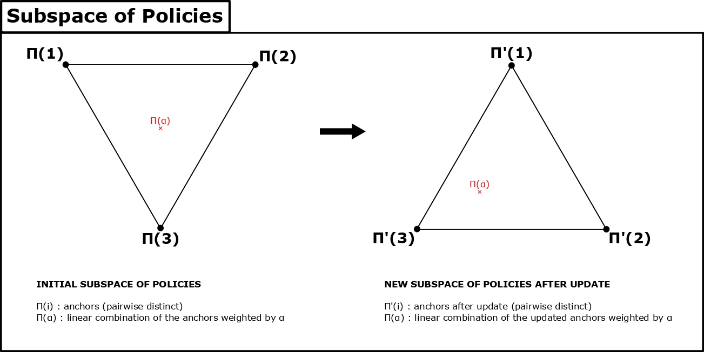

# Training a Subspace of Policies

Training a subspace of policies is quite different from getting one optimal policy as we strive to get a near infinite amount of well-performing policies.

It also greatly depends on the task at hand. Indeed, during the initial task, we have to find $n_{initial\_anchors}$ at the same time, while the following tasks only require to find a single anchor. In this case, the previously well-defined anchors are frozen.

## Overview

At a given time, the anchors should yield great results, and most policies sampled within the anchors' convex hull should also perform well.

In order to leverage traditional training methods, we thus first sample $n_{anchors}$ weights $(w_i)_i$ using a Dirichlet distribution. A policy resulting from the linear combination of the anchors weighted by the $w_i$ is then used in the same way as a regular training.

The weights are resampled when an episode is over, or every $repeat\_alpha$ timesteps. The weights can also be changed only when the current cumulated rewards are not satisfying enough compared to the top K rewards of the replay buffer, where K depends on the $refresh\_rate$ and $buffer\_size$ hyperparameters.

The training phase subsequently frequently updates the parameters of the free anchors (as opposed to the frozen ones), which also updates the current sampled policy as seen in Figure 1. It is important to note that if `resampling_policy = True`, then a new policy is sampled specifically for the anchors' updates.

**Figure 1.** *Policy update of the whole subspace*

Regarding the use of the actor and critic losses, they are actually almost identical to a regular training. The only difference is that the actor loss leverages an anticollapse term.

## Preventing the subspace from collapsing

In order to prevent the collapse of the subspace of policies, i.e. the convergence towards a single optimal policy (all anchors are the same), it is mandatory for **the anchors to be different enough**. Let's note $u$ and $v$ the parameters vectors of two anchors. There are two main ways to measure the pairwise similarities of the subspace anchors.

1. **Cosine Similarity** 
$$cos(u,v) = \frac{u\cdot v}{||u|| ||v||}$$

2. **Euclidean Distance**
$$L_2(u,v) = ||u-v||_2$$

Here, we only consider the pairwise cosine similarities, and add their sum as a penalty term for the actor loss. The sum is weighted by an **anticollapse coefficient**: the greater it is, the more different the anchors should be.

However, BBRL Subspaces currently has a few bugs regarding the support of the anticollapse coefficient. It seems that the latter has no impact on the subspace training at the moment. For instance, in the following figures, the reward curves overlap despite the different values of the anticollapse coefficient.

**Figure 2.a.** *CartPole Reward Curves for Anticollapse Coefficient = 0.1*

**Figure 2.b.** *CartPole Reward Curves for Anticollapse Coefficient = 1*

**Figure 2.c.** *CartPole Reward Curves for Anticollapse Coefficient = 100*
